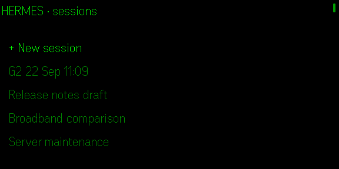
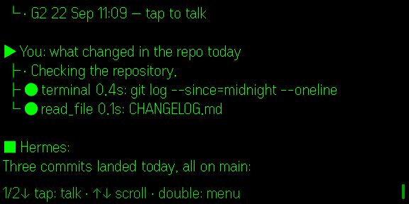
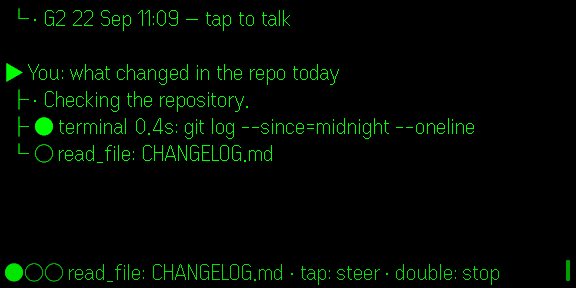
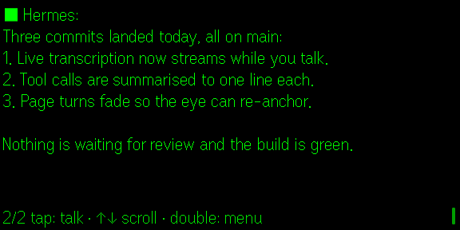
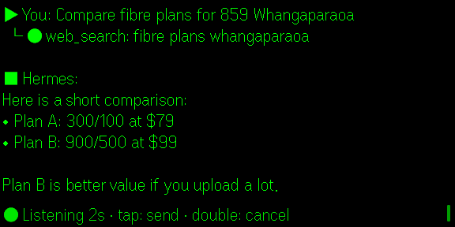
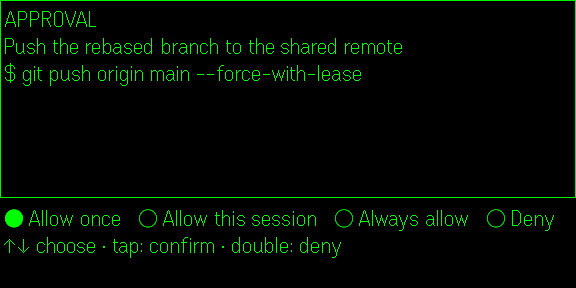

# Hermes G2

Talk to a self-hosted [Hermes Agent](https://github.com/NousResearch/hermes-agent) from Even Realities G2 glasses. The app is an Even Hub plugin (a web app running in the Even phone app's WebView) that uses the Hermes **Runs API** for live, interstitial-step streaming, approvals and steering, and the R1 ring / temple touchpads for control.

```
G2 mic ──PCM──▶ STT (proxy or provider) ──text──▶ Hermes /v1/runs ──SSE events──▶ glasses feed
                                                        │  tool.started / tool.completed / message.delta
                                                        │  approval.request  ◀── ring: choose + tap
                                                        └  steer / stop     ◀── voice / contextual menu
```

## What it does

| Screen | Tap | Swipe up / down | Double-tap | Tap-then-hold (contextual menu) |
|---|---|---|---|---|
| **Sessions** (list) | open session / `+ New session` | move selection (firmware) | **exit app** (system confirm dialog) | New session · Reconnect |
| **Chat**, idle | start listening | scroll transcript one page | back to sessions | New session · Sessions · Reconnect · Last chart |
| **Chat**, listening | stop & send (ignored if no audio) | – | cancel listening | |
| **Chat**, run in progress or reply being typed | listen → send as **steer** | scroll (auto-follow resumes when you scroll past the end) | **stop**: interrupts the run and ends the reveal, keeping the text shown so far | Stop run |
| **Approval** | confirm highlighted choice | move between choices | Deny | |
| **Chart** | back to chat | back to chat | back to chat | |

**Long press** (press and hold, on any screen but an approval) **hides the app**: the display goes blank while the app keeps running, so a run in progress carries on and its answer is waiting when you come back. Any gesture brings the display back where you left it; an approval request brings it back on its own. (The SDK has no background/hide call, and exiting would drop the session, so hiding is a blank page; black is transparent on the lens.)

The chat feed shows every interstitial step, not just the answer:

```
▶ You: what changed in the repo today
 ├ · Let me look into that.
 ├ ● terminal 0.9s: ls -la ~/projects | head
 ├ × web_search 0.5s: even realities g2 sdk
 │ → HTTP 429 rate limited by provider
 └ » subagent: Summarise the directory listing

■ Hermes:
The directory has 12 entries. The only document is
notes.md …
```

Answers are revealed at a steady **typing speed** (slowest ≈ 6, slow ≈ 11, normal ≈ 18, fast ≈ 30 characters per second, word by word) rather than repainted on every model delta, which is easier on the eyes; set it to `off` to see raw streaming. **Scrolling** has two modes: `page` (default) redraws a page per swipe, always by the same number of lines (a page or half-page step), with a **page turn** cue so the eye can re-anchor: `fade` (default: the old page dims, the new one comes in dim and ramps to full brightness over about half a second) or `none`; `smooth` (experimental) keeps a multi-page window in the container and lets the glasses scroll it natively one line per swipe with a scrollbar, swapping the window only at the edges. Because the firmware always shows the top of newly loaded text, reading *down* is seamless (the last visible lines carry over into the next window) while going *up* past the loaded window is a page jump with one line of overlap; while output is streaming the window is just the latest page, so the first swipe up after an answer is that jump.

Turns are labelled (`▶ You:` / `■ Hermes:`) and flush-left; everything that happens in between (tool steps `○/●/×` running / done / failed, `·` commentary or system notes, `»` subagents, `?` approvals) hangs off the turn as a tree (`├` / `└`, continuation lines under `│`). When an answer starts, the page is anchored so its `■ Hermes:` line is the first thing on screen, and it stays there while the answer streams in; swipe to read on, which releases the anchor. The status bar animates (`●○○ → ○●○ → ○○●`) whenever something is in flight and names the state: connecting, thinking, the running tool, working (polling), waiting for approval, transcribing, sending. Only glyphs present in the G2 firmware font are used (see `scripts/check-glyphs.mjs`).

By default (**Tool calls**: `collapsed`) a turn's tool calls fold into a single `○ working… · 3 tools: terminal, web_search` step that turns into `● worked · …` when they finish; failed calls stay on their own `×` line, and the status bar still names the tool that is running. Set it to `expanded` for one line per call.

On launch the app drops straight into a fresh session (**On launch**: `new`); `latest` reopens the most recent session and `menu` shows the session list. A new session is only created on the gateway when you send the first message, so opening the app without talking leaves nothing behind.

Every run carries short context as the run's `instructions` (Hermes applies it as an ephemeral system prompt; it is not stored in the session): that the user is on G2 glasses with a 9-line × ~60-character plain-text display and speech-to-text input, the local date, time and zone, and — with **Share location** on (default) — the phone's location fix (requires the `location` permission).

**Charts** (on by default): the run instructions also tell the agent it may end a reply with one fenced `g2chart` block, e.g.

````
```g2chart
{"type":"bar","title":"Steps this week","labels":["Mon","Tue"],"values":[8200,9100],"unit":"steps","caption":"Best day: Tue"}
```
````

`type` is `bar` (≤12 values), `line` (≤60) or `gauge` (one value with `min`/`max`). The app cuts the block out of the answer (a `[chart] Title` line stays in the transcript; a block still streaming is never shown), draws it on the phone and sends it to the glasses as two 288×144 PNG tiles (the firmware's image-container limit) under a title and caption. The chart opens by itself once the answer has finished revealing; any gesture returns to the chat and **Last chart** in the context menu reopens it. Set **Charts** to `off` to stop asking for them. With the mock gateway, say "chart", "trend" or "gauge" (`npm run simulate:chart`).

Tool events carry raw JSON previews; the feed reduces each call to the tool name plus its one meaningful argument (command, query, path, url …) and hides results unless the call failed. The **Transcript detail** setting switches to `verbose` (argument and result previews, reasoning summaries) when you want more.

Approvals use every choice the gateway offers (`once`, `session`, `always`, `deny`; fewer when the gateway flags a command as risky). If the live stream drops, the app falls back to polling `GET /v1/runs/{id}` and still surfaces pending approvals from the run status.

## Screenshots

Captured from the simulator (`store/screenshots/` holds the raw 576×288 frames the store expects; these are composited on black).

| | |
|---|---|
|  |  |
|  |  |
|  |  |

## Layout

```
src/main.ts              bridge bootstrap, event fan-out
src/app/controller.ts    state machine: sessions ⇄ chat ⇄ approval, runs, mic
src/app/feed.ts          transcript model, wrapping + paging
src/hermes/client.ts     Hermes API client (sessions, runs, SSE via fetch, approval, steer, stop)
src/glasses/display.ts   page layouts + coalesced text upgrades
src/glasses/input.ts     ring/temple event → gesture
src/stt/                 PCM → WAV, transcription entry point
src/ui/companion.ts      phone-side settings / test / mirror / log
shared/stt-providers.mjs ElevenLabs Scribe · OpenAI-compatible · Deepgram adapters (used by app + proxy)
shared/stt-live.mjs      Deepgram live (streaming) client, used by the app (direct) and the proxy relay
src/stt/live.ts          live session: proxy relay or direct Deepgram, with batch fallback
proxy/server.mjs         CORS-clean reverse proxy for Hermes + STT relay (batch + live WebSocket)
proxy/ws-min.mjs         dependency-free RFC 6455 server framing for the live relay
scripts/mock-hermes.mjs  fake gateway for the simulator
scripts/hermes-cors-patch.py  optional: patch the real gateway instead of proxying
```

## 1. Gateway: proxy (recommended) or patch

The stock Hermes gateway does **not** put CORS headers on the `GET /v1/runs/{id}/events` stream (its CORS middleware runs after the streaming response has already sent its headers), and it returns `403` to any request carrying an `Origin` header unless `API_SERVER_CORS_ORIGINS` is set. Both break a WebView client. The community `hermes-cors-patch.py` no longer matches upstream because the run handlers moved to `gateway/platforms/api_server_runs.py`, so it silently does nothing.

**Option A — install the proxy on the gateway host (or anywhere on your tailnet).** One command on Linux, macOS or Windows; it needs Node 22+ (20 works without live transcription) and nothing else:

```bash
# Linux / macOS
curl -fsSL https://raw.githubusercontent.com/lonelycode/hermes-g2/main/proxy/install.sh | bash
```

```powershell
# Windows (PowerShell)
irm https://raw.githubusercontent.com/lonelycode/hermes-g2/main/proxy/install.ps1 | iex
```

Both run `npx --package=github:lonelycode/hermes-g2 hermes-g2-proxy setup`, an interactive wizard that finds `API_SERVER_KEY` in `~/.hermes/.env`, checks the gateway and your speech-to-text key, writes `~/.hermes-g2-proxy/.env`, prints the URL to enter on the phone, and offers to start the proxy automatically (systemd user unit on Linux, launchd agent on macOS, hidden scheduled task on Windows). Afterwards:

```bash
npx hermes-g2-proxy doctor             # re-check gateway, key, STT; print phone URLs
npx hermes-g2-proxy service status     # also: logs | uninstall | install | show
npx hermes-g2-proxy run                # foreground, e.g. for debugging
```

`service show` prints the exact systemd unit / launchd plist / scheduled task it would install. `service install` first copies the proxy into `~/.hermes-g2-proxy/app/` and runs it from there (never from the npx cache, which npm prunes); re-run it after upgrading. On Linux without root it installs a user unit and enables login lingering so the proxy also starts at boot; run as root and it becomes a system unit.

(Once the package is on npm, `npx hermes-g2 setup` works without the `--package=github:…` spelling.) From a checkout, `npm run proxy:setup` and `npm run proxy` do the same, and a `.env` in the repo root overrides the home config.

The proxy forwards everything else to Hermes untouched (streaming both ways, `Origin` stripped so the gateway's own CORS list is irrelevant), adds CORS to every response including SSE, authenticates the phone with `PROXY_AUTH_KEY` (defaults to `HERMES_API_KEY`) before injecting the real gateway key upstream, and serves `POST /stt/transcribe` plus the `ws://…/stt/stream` live relay so the STT key never lands on the phone. Point the app at `http://<host>:8643`. Set `STT_LIVE_DEBUG=1` to log the raw Deepgram messages.

**Option B — patch the gateway** (re-apply after `hermes update`):

```bash
python3 scripts/hermes-cors-patch.py ~/.hermes/hermes-agent   # idempotent, keeps .bak-cors
# in the gateway env: API_SERVER_CORS_ORIGINS=*  (or the WebView origin)
systemctl restart hermes-gateway
```

Then point the app straight at `http://<tailnet-ip>:8642` and pick a direct STT mode.

**Unpatched gateway, no proxy:** the app still works in a degraded mode. When the event stream is blocked it falls back to polling `GET /v1/runs/{id}` every 2 s, so you get the final answer, failures and approval prompts, but not the live tool-by-tool steps (the status bar shows the gateway's `last_event` instead). You must still set `API_SERVER_CORS_ORIGINS=*`, otherwise every request from the WebView gets a 403.

Keep the gateway on a private network (Tailscale). Never expose it or the proxy to the public internet: the proxy passes through whatever bearer token the client sends.

## 2. Speech-to-text

The glasses deliver raw 16 kHz PCM; Hermes has no audio endpoint, so a transcription provider is required. Supported: **ElevenLabs Scribe** (`scribe_v1`), any **OpenAI-compatible** `/v1/audio/transcriptions` (OpenAI, Groq, whisper.cpp / faster-whisper servers), **Deepgram** (`nova-3`). Choose `proxy` mode in the app to keep the key on the server, or a direct mode with the key entered on the phone.

**Live preview.** With `proxy` mode (when the proxy's `STT_PROVIDER=deepgram`) or `deepgram` mode, the transcript streams onto the glasses while you talk: the pending turn appears at the bottom of the feed as `▶ what changed in the …` and updates every few hundred milliseconds, so you can see a mis-hearing before you send. The second tap flushes the stream and sends the final text (typically within 200 ms). The proxy relays this over a WebSocket at `ws://<proxy>/stt/stream` (authenticated with the same key), so whitelist the proxy's `ws://` origin as well as `http://` in `app.json` when packaging. ElevenLabs and OpenAI modes have no live path; they transcribe the whole clip after the second tap, and the app also falls back to that if the live socket fails.

Clips shorter than 0.3 s or quieter than the RMS threshold (default 200, tune it in settings using the audio stats shown in the companion UI) are discarded.

## 3. Run it

```bash
npm install
cp .env.example .env.development.local   # optional dev-only defaults (VITE_HERMES_URL, VITE_HERMES_KEY, …); never baked into builds
npm run dev                    # Vite on :5173
```

**Simulator** (no hardware): `npm run mock` (fake Hermes on :8642, key `mock`) then `npm run simulate -- http://localhost:5173` (npm does not link the simulator's binary into `.bin`, so `npx evenhub-simulator` fails; the script calls it directly). Say "approve" to trigger an approval, "slow" for a long run to steer or stop, "fail" for a failure. The simulator has no microphone; use `--aid` to pick an audio device, or drive it headlessly:

```bash
npx evenhub-simulator http://localhost:5173 --automation-port 9898
curl -X POST localhost:9898/api/input -H 'content-type: application/json' -d '{"action":"click"}'
```

**Real glasses**: enable Developer Mode in the Even app, then

```bash
VITE_HMR_HOST=<your-lan-or-tailnet-ip> npm run dev
npx evenhub qr --url "http://<your-lan-or-tailnet-ip>:5173"
```

Scan the QR from the Even Hub tab. The companion page on the phone is where you enter the gateway URL and key, run **Test Hermes**, watch a live mirror of the glasses, and can type a message instead of talking.

Simulator quirks worth knowing: its `/api/console` only flushes when bridge traffic happens and idle timers are throttled, so judge behaviour by `/api/screenshot/glasses`, not console timing. In dev builds `?say=hello%7Csecond&gap=8000` on the app URL types messages on a timer for scripted runs.

## 4. Package and ship

1. **Whitelist** — put the exact origins the app will talk to in `app.json` → `network.whitelist`: your proxy as both `http://host:8643` and `ws://host:8643` (the live-transcription socket), plus any direct STT host. Wildcards are not supported.
2. **Build and pack** — production builds ignore every `.env*` file and `scripts/check-bundle.mjs` refuses to package a bundle containing a key from them:

   ```bash
   npx evenhub login                 # once; needed for the package_id check and uploads
   npm run pack:check                # first time only: build → secret check → evenhub pack -c (is the package_id free?)
   npm run pack                      # every later release (the id is yours now, so -c would report it "taken") → hermes-g2.ehpk
   ```
3. **Private build** — dev portal → your project → *Private builds* → upload `hermes-g2.ehpk`; on the phone: Even Hub tab → *Me → Apps → Private builds* → Install. This is the first place the manifest, permissions prompts and whitelist are enforced for real.
4. **Beta build** — assign the build to a beta group and re-test with the phone locked for five minutes (reviewers do exactly this).
5. **Submit** — Test → Submitted with 1–3 lines of release notes. Reviewers check the manifest, a legible greyscale icon (`public/icon.png`, drawn in the portal's 24×24 editor), a privacy policy covering every permission (`PRIVACY.md`), a first-run screen that explains setup (the app shows "Hermes unreachable … set the gateway URL and key in the phone app"), root-page double-tap → system exit dialog, and locked-phone operation.

Released versions are immutable: fixes ship as a higher `version`.

## Hermes API surface used

`GET /health` · `GET /v1/capabilities` · `GET/POST /api/sessions` · `GET /api/sessions/{id}/messages` · `POST /v1/runs` · `GET /v1/runs/{id}` · `GET /v1/runs/{id}/events` (SSE: `message.delta`, `message.interim`, `tool.started`, `tool.completed`, `reasoning.available`, `subagent.start/complete`, `approval.request`, `approval.responded`, `run.steered`, `run.completed/failed/cancelled/interrupted`) · `POST /v1/runs/{id}/approval` · `POST /v1/runs/{id}/steer` · `POST /v1/runs/{id}/stop`.

Clarifying questions from the agent (the `clarify` tool) have no API-server transport in Hermes today; they arrive as the run's final text and you answer by talking.

## Tests

```bash
npm test          # text wrapping, feed paging, SSE parser, WAV helpers (node:test)
npm run typecheck
```

## License

[GNU AGPL v3](LICENSE.md).
